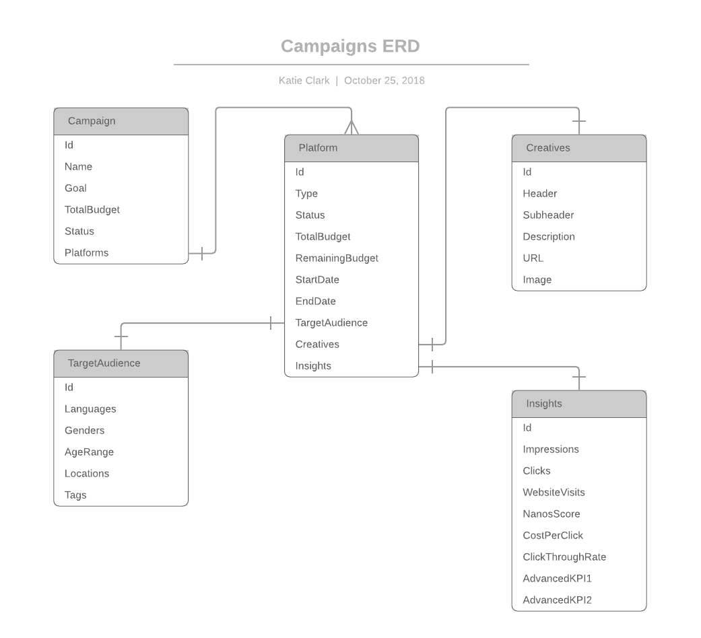
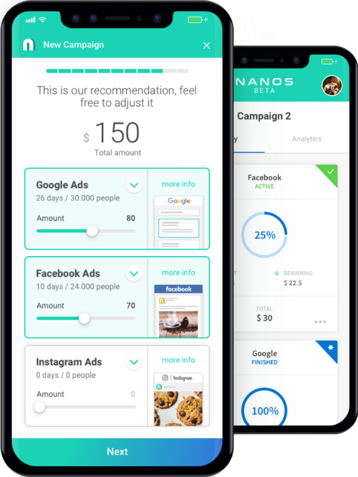

# Nanos Application

This project consists of a Mongo database, an API written using ExpressJS, and a ReactJS client. The 
project can be deployed using Docker. Instructions are below.

`./api/seeddb.js` is used to populate the database with the data from the `./api/data.json` file when 
first building the application (this will be triggered from within the docker-compose script).

## Docker Containers
Running `docker-compose` will spin up 4 containers for the app
1. A container running Mongo
2. A container that runs a script to seed the Mongo db with data and immediately shuts down on completion
3. A container that runs the API using ExpressJS
4. A container for the app which uses ReactJS

### To run in development mode
In this mode the containers for the API and React app are mounted to the local drive so any changes are 
immediately copied to the container and used. The webpack devserver is used to serve the client code.

`docker-compose -f docker-compose-dev.yml up --build`

### To run in production mode
In this mode the React app is transpiled using webpack and served on an ecstatic server

`docker-compose up --build` 

### To run the tests

`docker-compose -f docker-compose-test.yml up --build`

The intention was to have 3 containers running - a Mongo instance, an API intsance, and a client 
instance. The Mongo instance was to be used in testing the Mongoose model definitions operate with the 
expected constraints from within the API tests. In all other ways the containers would be decoupled and 
not reliant on each other, the only purpose of putting them in one docker-compose file was so they could
all run at once.

Given more time I would have completed writing tests for the React components. I spent some time getting 
some simple tests running using enzyme. My intention was to test at least the following:
1. The CampaignList displays the correct number of CampaignSummary's / does not break if given no or 
invalid data
2. The View displays the correct component when given a State / does not break if given undefined or 
invalid state
3. The App updates the State correctly when given an Action / does not break if given invalid Action
4. Test the BackButton in the CampaignDetail component changes the state
5. Test that on clicking a CampaignSummary the state and state data is correctly updated to hold the 
correct campaignId
6. Handling timeout requests to the API / return of unexpected data

Unfortunately I am running out of time and learning the enzyme library in order to complete these tests 
is not reasonable at this point in the project.

## Data Structure

The above collections are created in Mongo using the seed script and Mongoose model definitions. After 
further research into Mongo and NoSQL databases I realise it's not required the collections be split in 
this way as the campaigns never contain duplicated data (in the way many books may share the same author). 
However I have left it split as the code was already written along with the tests and there is limited
time to be spent on this. 

Some attribute names were changed when storing data as I spotted audience `Keywords` and `interests` seem to 
relate to the same thing. These are now named as `tags` in the database and could be translated back to
their original name in the client as the name seems to depend on the platform-type.

The same goes for attributes `header` or `header_1` & `header_2`. These have been translated into `header` & 
`subheader` in the database and I would expect them to be translated back in the client depending on the
platform-type.

## Design

The design of the client is an imitation of what is shown in the image from your website. For 
this reason it hasn't gone so far as showing all the details of Audiences, Insights, and Creatives. The
reason these were missed were simply the time constraints and the fact that the skills for creating and
rendering components were already display and I was concerned with efficiency of use of my time to best 
display the range of skills.

## Given more time

Were I to spend more time on this - along with cleaning up many aspects of testing and error handling in
the case pf unexpected events I would like to have incorporated use of Redux, MaterialUI, and ReactRouter. 
I also would have spent time ensuring proper user account setup on the database with authentication for 
security.

I have never been a professional React or Javascript developer so most of this has been learnt from 
scratch. Were it a full time role I'm sure I would pick up more of the related skills and libraries very
quickly.